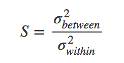

## Dimension Reduction

### Definition

- Similar to compressing the data:  **Compress large set of features onto a new feature subspace of lower dimensional without losing the important information.**
- Dimension reduction will lose some information
- 낮은 차원으로 데이터를 매핑하는 방식을 찾아내는 것. Finding a smaller set of new variables, each being a combination of the original input. 데이터의 내재적 속성을 찾아내는 것.


### Why important?

- Solve the curse of dimensionality - 차원이 높아질 수록 Euclidean distance가 예상치 못한 방식으로 동작한다.
- Can reduce the complexity required to train machine learning models
- Can eliminate overfitting
- Remove redundant features (multicollinearity)
- Visualizing data


### Techniques

- Supervised :

  - Linear mapping - Linear Discriminant Analysis (LDA): 클래스를 최대한 잘 분리하는 projection을 찾는다. 같은 클래스의 variance는 줄이고, 다른 클래스간의 variance를 키우는 방향으로 움직인다.
    

    ``` python
    from sklearn.lda import LDA
    LDA(n_components=3).fit_transform(X_train, y_train)
    ```

  - CNN Pooling :

    - 지역 수용 영역 : 지역적인 구조를 인코딩 - 인접한 입력 뉴런의 부분 행렬들을 다음 계층에 있는 한 개의 은닉 뉴런으로 연결
    - 풀링 : 맵 출력을 요약, 하나의 특징 맵으로부터 나온 출력에서 공간 인접성을 활용해 부분 행렬 값들을 물리적인 지역에 관련된 의미를 종합적으로 설명하는 출력 값으로 결합

        - max pooling : 관찰한 최대 활성화를 출력
        - DCNN의 낮은 계층에서는 색상이나 가장자리 같은 낮은 차원의 특징을 식별.
        - 중간계층은 이미지에서 중요한 특징을 추출할 수 있는 능력을 가지고 있다.


- Unsupervised : 

  - Linear mapping - Principal Component Analysis (PCA): find points with maximum variance
    ``` python
    from sklearn.decomposition imiport PCA
    PCA(n_components=3).fit_transform(X_train)
    ```

    Principal Component : 데이터를 가장 넓게 펼치는 축 = 가장 큰 분산을 가지는 축
    최대 분사는 갖는다는 것은 = 각 벡터들이 서로 간의 연관성을 최소로 만든다는 것. => 공분산의 eigenvector.

    Covariance(공분산) :점들의 그룹과 다른 점들의 그룹과의 관계를 나타내는 지표.

  - **ANOVA F-Value** : it is possible to determine which features are responsible for why the selected cluster is different from all other clusters. [2]

  - **Spectral Clustering** which reduces data to a low-dimensional embedding and then clusters data. [2]

  - Autoencoder 


### Applications


References :

- https://medium.com/fintechexplained/what-is-dimension-reduction-in-data-science-2aa5547f4d29
- http://sanghyukchun.github.io/72/
- https://www.analyticsvidhya.com/blog/2018/08/dimensionality-reduction-techniques-python/
- 케라스로 구현하는 딥러닝과 강화학습 [Deep Learning with Keras] by Antonio Gulli, Sujit Pal
- [2] Kwon, Bum Chul, et al. "Clustervision: Visual supervision of unsupervised clustering." IEEE transactions on visualization and computer graphics 24.1 (2018): 142-151.